# PrimeTrade Architecture Overview

**Project:** django-primetrade (Bill of Lading Management System)
**Date:** November 2, 2025
**Author:** Claude Code (Diagnostic Analysis)
**Purpose:** Production readiness assessment for CTO strategic planning

---

## Table of Contents

1. [Executive Summary](#executive-summary)
2. [System Architecture Diagram](#system-architecture-diagram)
3. [Component Architecture](#component-architecture)
4. [Authentication Flow](#authentication-flow)
5. [Data Flow](#data-flow)
6. [Database Architecture](#database-architecture)
7. [Deployment Architecture](#deployment-architecture)
8. [Integration Points](#integration-points)
9. [Architecture Decisions](#architecture-decisions)
10. [Security Architecture](#security-architecture)
11. [Scalability Considerations](#scalability-considerations)

---

## Executive Summary

PrimeTrade is a Django 4.2 web application that manages Bill of Lading (BOL) documents for Cincinnati Barge & Rail Terminal. The architecture follows a traditional Django MVC pattern with:

- **Backend:** Django REST Framework API (18 endpoints)
- **Frontend:** Vanilla JavaScript SPA with static HTML pages
- **Authentication:** OAuth 2.0 SSO via barge2rail-auth server
- **Database:** PostgreSQL (Neon) for production, SQLite for development
- **Deployment:** Render (Ohio region) with WhiteNoise static file serving
- **PDF Generation:** ReportLab for BOL document creation

**Key Architectural Characteristics:**
- Monolithic Django application (single codebase)
- Session-based authentication with JWT role validation
- RESTful API design with JSON responses
- Static file serving via CDN (Render/WhiteNoise)
- External SSO integration for centralized auth
- Audit logging with optional Galactica forwarding

**Scale:** Designed for 6-8 concurrent users (small team, high reliability requirements)

---

## System Architecture Diagram


---

## Component Architecture

### Django Application Structure


### Core Models (12 Total)


---

## Authentication Flow

### SSO OAuth 2.0 Flow


### Current Authentication Issues

```mermaid
graph TD
    A[User Authenticates] --> B{JWT Contains<br/>primetrade Role?}
    B -->|Yes| C[Grant Access<br/>Normal Flow]
    B -->|No| D{Email in<br/>ADMIN_BYPASS_EMAILS?}
    D -->|Yes| E[BYPASS: Grant Admin<br/>⚠️ SECURITY ISSUE]
    D -->|No| F[403 Forbidden<br/>No Access]

    E --> G[User Has Full Access<br/>Role: admin<br/>Permissions: bypass_access]
    C --> H[User Has Role-Based Access<br/>Role: from JWT<br/>Permissions: from JWT]

    style E fill:#ff9999
    style G fill:#ffcccc
    style D fill:#ffff99
```



---

## Data Flow

### BOL Creation Flow (Office User)


### Release Approval Flow (Admin User)


---

## Database Architecture

### Database Schema (PostgreSQL on Neon)


### Database Indexes (Performance)

From migration `0006_performance_indexes.py`:

```sql
-- Release indexes for status filtering and date sorting
CREATE INDEX idx_release_status ON bol_system_release(status);
CREATE INDEX idx_release_created_at ON bol_system_release(created_at);
CREATE INDEX idx_release_status_created ON bol_system_release(status, created_at);

-- ReleaseLoad indexes for status filtering and release joins
CREATE INDEX idx_releaseload_status ON bol_system_releaseload(status);
CREATE INDEX idx_releaseload_release ON bol_system_releaseload(release_id);
CREATE INDEX idx_releaseload_status_release ON bol_system_releaseload(status, release_id);

-- BOL indexes for common queries (by product, date, customer)
CREATE INDEX idx_bol_product ON bol_system_bol(product_id);
CREATE INDEX idx_bol_date ON bol_system_bol(date);
CREATE INDEX idx_bol_customer ON bol_system_bol(customer_id);
CREATE INDEX idx_bol_product_date ON bol_system_bol(product_id, date);
```

**Query Optimization:**
- Release dashboard: `status='pending'` + `ORDER BY created_at` → Uses `idx_release_status_created`
- Pending loads: `status='pending'` + `release_id` → Uses `idx_releaseload_status_release`
- BOL history: `product_id` + `date` → Uses `idx_bol_product_date`

---

## Deployment Architecture

### Render Deployment (Production)


### Environment Configuration

**Required Environment Variables (12):**

```bash
# Django Core
SECRET_KEY=<django-secret-key>
DEBUG=False
ALLOWED_HOSTS=primetrade.onrender.com,.onrender.com

# Database (Neon PostgreSQL)
DATABASE_URL=postgresql://<user>:<password>@<host>/<dbname>

# SSO Integration (barge2rail-auth)
SSO_BASE_URL=https://barge2rail-auth.onrender.com
SSO_CLIENT_ID=<oauth-client-id>
SSO_CLIENT_SECRET=<oauth-client-secret>
SSO_REDIRECT_URI=https://primetrade.onrender.com/auth/callback/
SSO_SCOPES=openid profile email roles

# Temporary Admin Bypass (⚠️ REMOVE IN PRODUCTION)
ADMIN_BYPASS_EMAILS=clif@barge2rail.com

# Optional Audit Forwarding
GALACTICA_URL=https://galactica.onrender.com/api/events
```

### Deployment Process (render.yaml)

```yaml
services:
  - type: web
    name: primetrade
    runtime: python
    region: ohio
    plan: starter  # Or higher for production
    buildCommand: |
      pip install -r requirements.txt
      python manage.py collectstatic --noinput
      python manage.py migrate
    startCommand: gunicorn primetrade_project.wsgi:application
    envVars:
      - key: PYTHON_VERSION
        value: 3.11.6
      - key: DATABASE_URL
        fromDatabase:
          name: primetrade-db
          property: connectionString
      # ... (12 environment variables from secrets)

databases:
  - name: primetrade-db
    databaseName: primetrade
    user: primetrade_user
    region: ohio
```

**Build Process:**
1. Render pulls code from GitHub (`CBRT513/django-primetrade`)
2. Installs dependencies: `pip install -r requirements.txt`
3. Collects static files: `python manage.py collectstatic --noinput`
4. Runs migrations: `python manage.py migrate`
5. Starts Gunicorn: `gunicorn primetrade_project.wsgi:application`

**Static File Handling:**
- Development: Django serves from `static/` directory
- Production: WhiteNoise serves from `staticfiles/` (collected)
- CDN: Render CDN caches static assets for fast delivery

---

## Integration Points

### 1. SSO Integration (barge2rail-auth)

**Protocol:** OAuth 2.0 Authorization Code Flow
**Implementation:** `primetrade_project/auth_views.py` (384 LOC)
**JWT Library:** PyJWT 2.8.0

**Integration Points:**
- **Authorization Endpoint:** `GET /o/authorize/` - Initiate login
- **Token Endpoint:** `POST /o/token/` - Exchange code for tokens
- **Userinfo Endpoint:** `GET /o/userinfo/` - Get user claims (fallback)
- **Logout Endpoint:** `GET /o/logout/` - SSO logout

**Data Flow:**
1. User clicks "Login" → Redirect to SSO `/o/authorize/`
2. User authenticates at SSO → Redirect back with `code` + `state`
3. App exchanges `code` for `access_token` + `id_token` (JWT)
4. App decodes JWT, extracts `email` + `application_roles['primetrade']`
5. App creates/updates Django User, stores role in session
6. User accesses app with role-based permissions

**Current Issue:** JWT signature not verified (`verify_signature=False`)
**Workaround:** Admin bypass via `ADMIN_BYPASS_EMAILS` environment variable

### 2. Database Integration (Neon PostgreSQL)

**Database:** Neon Serverless PostgreSQL
**Region:** Ohio (same as Render for low latency)
**Connection:** Via `DATABASE_URL` environment variable
**ORM:** Django ORM (no raw SQL)

**Connection Pooling:**
- Django manages connection pool internally
- Neon auto-scales compute based on load
- Free tier: Shared compute, 0.5 GB storage

**Migration Management:**
- Migrations stored in `bol_system/migrations/`
- Applied via `python manage.py migrate` on deployment
- Current: 7 migrations (0001 through 0007 pending)

### 3. Galactica Audit Forwarding (Optional)

**Endpoint:** `POST /api/events` (configurable via `GALACTICA_URL`)
**Trigger:** After every AuditLog creation
**Implementation:** `bol_system/models.py` - AuditLog.save()

**Data Sent:**
```json
{
  "entity_type": "BOL",
  "entity_id": 123,
  "action": "create",
  "user": "user@example.com",
  "changes": {...},
  "notes": "BOL created via office interface",
  "timestamp": "2025-11-02T10:30:00Z"
}
```

**Error Handling:** Silent failure (logs error, doesn't block operation)

### 4. PDF Generation (ReportLab)

**Library:** ReportLab 4.0.7
**Implementation:** Inline in `bol_system/views.py` - `generate_bol_pdf()`
**Storage:** Local filesystem (`media/bols/PRT-YYYY-####.pdf`)

**Template:** Hardcoded in Python code (no external template)
**Content:**
- Company branding (Cincinnati Barge & Rail Terminal)
- BOL number (PRT-YYYY-####)
- Customer, Ship-To, Carrier details
- Product, Lot, Net Tons, Total Weight (lbs)
- Date, PO Number, Buyer Name

---

## Architecture Decisions

### ADR-001: Django Monolith vs. Microservices

**Decision:** Use single Django monolith
**Context:** 6-8 users, single business domain (BOL management)
**Rationale:**
- Low traffic volume doesn't justify microservices complexity
- All features tightly coupled (BOL → Release → Product → Customer)
- Small team (1 developer) - easier to maintain monolith
- Render deployment simpler with single service

**Consequences:**
- ✅ Faster development (no API contracts between services)
- ✅ Single codebase, easier debugging
- ❌ Future scaling requires refactoring if needed
- ❌ Can't scale BOL creation independently from product management

**Status:** Accepted, working well for current scale

---

### ADR-002: Session-Based Auth vs. JWT-Only

**Decision:** Hybrid - Django sessions with JWT role validation
**Context:** SSO provides JWT, but Django best practices use sessions
**Rationale:**
- Django auth system built around sessions (login/logout, middleware)
- JWT provides role information from SSO
- Session stores role + tokens for stateful Django views
- CSRF protection works naturally with sessions

**Implementation:**
- User authenticates via SSO OAuth → Receives JWT
- JWT decoded to extract `application_roles['primetrade']`
- Role stored in `request.session['primetrade_role']`
- Django creates `User` object, calls `login(request, user)`
- Subsequent requests use session cookie (not JWT)

**Consequences:**
- ✅ Leverages Django's robust session management
- ✅ CSRF protection automatic
- ❌ Session state not shared across multiple app instances (sticky sessions needed)
- ❌ JWT signature not verified (trust SSO server)

**Status:** Accepted, but JWT verification should be added

---

### ADR-003: Static HTML SPA vs. Django Templates

**Decision:** Vanilla JavaScript SPA with static HTML
**Context:** Need responsive UI, but team knows JavaScript better than Django templates
**Rationale:**
- Static files easier to cache/CDN (WhiteNoise)
- Client-side rendering reduces server load
- Separation of concerns (API backend, JS frontend)
- No need for complex framework (React/Vue) at this scale

**Implementation:**
- 9 static HTML pages (`index.html`, `office.html`, `client.html`, etc.)
- Inline JavaScript for API calls
- CSS branding (`cbrt-brand.css`)
- Django serves API endpoints only

**Consequences:**
- ✅ Fast page loads (cached static files)
- ✅ Clear API boundary (easier to test)
- ❌ Duplicate HTML structure across pages (no components)
- ❌ SEO may be poor (client-side rendering)

**Status:** Accepted for internal app (no SEO needed)

---

### ADR-004: Admin Bypass for SSO Testing

**Decision:** Temporary bypass via `ADMIN_BYPASS_EMAILS` environment variable
**Context:** SSO not returning `application_roles['primetrade']` in JWT
**Rationale:**
- Production blocker - users can't login without role
- SSO server issue needs time to debug
- Need controlled way to grant access during rollout

**Implementation (auth_views.py:311-323):**
```python
if not primetrade_role:
    bypass_list = getattr(settings, 'ADMIN_BYPASS_EMAILS', [])
    if email and bypass_list and email.lower() in [x.lower() for x in bypass_list]:
        logger.error(f"[FLOW DEBUG 7.5.1] BYPASS engaged for {email}")
        primetrade_role = {"role": "admin", "permissions": ["full_access"]}
    else:
        return HttpResponseForbidden("You don't have access to PrimeTrade. Contact admin.")
```

**Security Implications:**
- ⚠️ Anyone in bypass list gets admin access (no role validation)
- ⚠️ Environment variable can be set in Render dashboard (not code)
- ⚠️ No audit trail for bypass usage (should log to AuditLog)

**Status:** ❌ MUST BE REMOVED OR FORMALIZED BEFORE PRODUCTION

**Options for Resolution:**
1. **Fix SSO** - Update barge2rail-auth to include `application_roles` in JWT
2. **Database Roles** - Store roles in PrimeTrade database (migrate from SSO)
3. **Temporary Admin UI** - Build admin interface to manually grant roles

---

### ADR-005: PostgreSQL (Neon) vs. SQLite for Production

**Decision:** PostgreSQL (Neon Serverless) for production
**Context:** Django default is SQLite, but production needs robustness
**Rationale:**
- SQLite not recommended for production (file locking issues)
- PostgreSQL supports concurrent writes (multiple Gunicorn workers)
- Neon free tier sufficient for current scale
- Easy migration path to paid tier if needed

**Configuration:**
- Development: SQLite (`db.sqlite3`)
- Production: PostgreSQL via `DATABASE_URL` env var
- Django settings auto-detect via `dj-database-url`

**Consequences:**
- ✅ Production-ready database
- ✅ Free tier (0.5 GB storage, shared compute)
- ❌ Slight dev/prod parity issue (different databases)
- ❌ Requires internet for local dev if using Neon

**Status:** Accepted, working well

---

### ADR-006: WhiteNoise for Static Files vs. S3/CDN

**Decision:** WhiteNoise middleware for static file serving
**Context:** Render recommends WhiteNoise for static files
**Rationale:**
- No external dependencies (S3 bucket, credentials)
- Render CDN caches WhiteNoise responses automatically
- Simple setup (just middleware + `collectstatic`)
- Cost: Free (included in Render plan)

**Implementation:**
- Middleware: `whitenoise.middleware.WhiteNoiseMiddleware`
- Storage: `staticfiles/` directory (created by `collectstatic`)
- Compression: Automatic gzip/brotli
- Cache headers: Far-future expiry (immutable URLs)

**Consequences:**
- ✅ Simple, no external dependencies
- ✅ Fast (CDN caching)
- ❌ Static files served by app workers (uses compute)
- ❌ No custom CDN configuration (S3 + CloudFront more flexible)

**Status:** Accepted for current scale (6-8 users)

---

## Security Architecture

### Threat Model

```mermaid
graph TD
    subgraph "Attack Vectors"
        A1[Unauthenticated Access]
        A2[CSRF Attack]
        A3[SQL Injection]
        A4[XSS Attack]
        A5[Session Hijacking]
        A6[Admin Bypass Abuse]
    end

    subgraph "Mitigations Implemented"
        M1[✅ SSO Required + LoginRequired Decorators]
        M2[⚠️ CSRF Token - But Bypassed on API]
        M3[✅ Django ORM - No Raw SQL]
        M4[✅ Template Auto-Escaping]
        M5[⚠️ Secure Cookies - But DEBUG=True in Dev]
        M6[❌ ADMIN_BYPASS_EMAILS - No Audit]
    end

    subgraph "Residual Risks"
        R1[🔴 Admin Bypass = Full Access]
        R2[🟡 CSRF Bypass on CsrfExemptSessionAuthentication]
        R3[🟡 JWT Signature Not Verified]
        R4[🟡 DEBUG=True Exposes Stack Traces]
    end

    A1 --> M1
    A2 --> M2
    A3 --> M3
    A4 --> M4
    A5 --> M5
    A6 --> M6

    M2 --> R2
    M6 --> R1
    M1 --> R3
    M5 --> R4

    style R1 fill:#ff9999
    style R2 fill:#ffff99
    style R3 fill:#ffff99
    style R4 fill:#ffff99
```



### Security Controls

**Authentication:**
- ✅ SSO OAuth 2.0 (barge2rail-auth)
- ✅ `@login_required` on all HTML pages
- ✅ `IsAuthenticated` permission on all API endpoints
- ⚠️ JWT signature not verified (trusts SSO)
- ❌ Admin bypass active (ADMIN_BYPASS_EMAILS)

**Authorization:**
- ⚠️ Role stored in session (`primetrade_role`)
- ❌ No role-based permission checks in views (all users = same access)
- ❌ Admin bypass grants full access without audit trail

**Input Validation:**
- ✅ Django REST Framework serializers validate API inputs
- ✅ Django ORM prevents SQL injection (parameterized queries)
- ⚠️ File uploads (PDF) - No malware scanning
- ⚠️ Chemistry values - No strict type validation

**Session Security:**
- ✅ `SESSION_COOKIE_SECURE=True` in production (HTTPS only)
- ✅ `SESSION_COOKIE_HTTPONLY=True` (no JavaScript access)
- ✅ `SESSION_COOKIE_SAMESITE='Lax'` (CSRF protection)
- ⚠️ `DEBUG=True` in dev exposes session keys in error pages

**CSRF Protection:**
- ✅ Django CSRF middleware enabled
- ❌ Bypassed on API via `CsrfExemptSessionAuthentication`
- Rationale: API consumed by same-origin JavaScript (session auth sufficient)

**Data Protection:**
- ✅ No PII in logs (email only, no SSN/payment info)
- ✅ Passwords not stored (SSO handles authentication)
- ❌ No encryption at rest (relies on Neon/Render)

**Audit Logging:**
- ✅ All create/update/delete operations logged (AuditLog model)
- ✅ User, timestamp, changes captured
- ⚠️ Admin bypass usage not logged
- ⚠️ Login/logout not logged

---

## Scalability Considerations

### Current Capacity

**Target Load:** 6-8 concurrent users
**Current Architecture:**
- Single Render web service (Starter plan)
- 1 Gunicorn instance, 4 workers
- Neon PostgreSQL free tier (shared compute)
- No caching layer

**Estimated Capacity:**
- **Users:** 6-8 concurrent (comfortable)
- **Requests/sec:** ~10-20 (typical office usage)
- **Database Queries:** ~100/sec (mostly reads)
- **PDF Generation:** ~1-2 PDFs/minute (synchronous, blocks request)

### Bottlenecks Identified

```mermaid
graph LR
    A[User Request] --> B[Gunicorn Worker<br/>⚠️ Limited to 4]
    B --> C[Django View<br/>⚠️ Synchronous PDF Gen]
    C --> D[PostgreSQL<br/>⚠️ Shared Compute]
    C --> E[PDF Generator<br/>⚠️ CPU Intensive]

    style B fill:#ffff99
    style C fill:#ffff99
    style D fill:#ffff99
    style E fill:#ffff99
```



**1. PDF Generation (Synchronous)**
- **Issue:** PDF generation blocks Gunicorn worker (~2-3 seconds)
- **Impact:** During peak (e.g., 5 BOLs/minute), all workers blocked
- **Mitigation:** Async task queue (Celery + Redis) or background generation

**2. Gunicorn Workers (Limited to 4)**
- **Issue:** Starter plan limits workers to 4 (based on CPU)
- **Impact:** 5th concurrent request waits for worker to free up
- **Mitigation:** Upgrade to Standard plan (more CPU/RAM)

**3. Neon Free Tier (Shared Compute)**
- **Issue:** Shared compute has variable latency (50-200ms)
- **Impact:** Slow queries under load
- **Mitigation:** Upgrade to paid tier (dedicated compute) or add caching

**4. No Caching Layer**
- **Issue:** Product, Customer, Carrier lists fetched on every page load
- **Impact:** Unnecessary database queries
- **Mitigation:** Django cache framework (Redis/Memcached) or HTTP caching

### Scaling Recommendations

**For 10-20 users:**
- Add Django caching (Redis) for read-heavy data (products, customers)
- Async PDF generation (Celery + Redis)
- Upgrade Neon to paid tier (dedicated compute)

**For 50+ users:**
- Upgrade Render to Standard/Pro plan (more workers)
- Add read replicas for Neon (if available)
- Consider CDN for PDF downloads (S3 + CloudFront)

**For 100+ users:**
- Horizontal scaling (multiple Render instances + load balancer)
- Database connection pooling (PgBouncer)
- Redis cluster for caching + sessions

---

## Appendix: Technology Stack

### Backend

- **Framework:** Django 4.2.7
- **API:** Django REST Framework 3.14.0
- **Database:** PostgreSQL (Neon Serverless)
- **ORM:** Django ORM
- **Authentication:** Django Auth + OAuth 2.0 (PyJWT 2.8.0)
- **WSGI Server:** Gunicorn 21.2.0
- **Static Files:** WhiteNoise 6.6.0

### Frontend

- **Pages:** Static HTML (9 pages)
- **JavaScript:** Vanilla JS (inline)
- **CSS:** Custom branding (`cbrt-brand.css`)
- **No Framework:** No React/Vue/Angular

### PDF Generation

- **Library:** ReportLab 4.0.7
- **Storage:** Local filesystem (`media/bols/`)

### Deployment

- **Platform:** Render (Ohio region)
- **Database:** Neon PostgreSQL (Ohio region, free tier)
- **CDN:** Render CDN (automatic)
- **TLS:** Let's Encrypt (automatic)
- **Environment:** python-decouple 3.8 for env vars

### Development Tools

- **Testing:** pytest 7.4.3, pytest-django 4.7.0 (16% coverage)
- **Code Quality:** radon, bandit (13 security issues)
- **Version Control:** Git + GitHub (CBRT513/django-primetrade)

---

## Document Metadata

**Generated:** November 2, 2025
**Generator:** Claude Code (Production Diagnostic)
**Project:** django-primetrade v1.0
**Location:** /Users/cerion/Projects/django-primetrade
**Next Steps:** Review FEATURE_MATRIX.md, PRODUCTION_GAPS.md, CTO_HANDOFF.md
