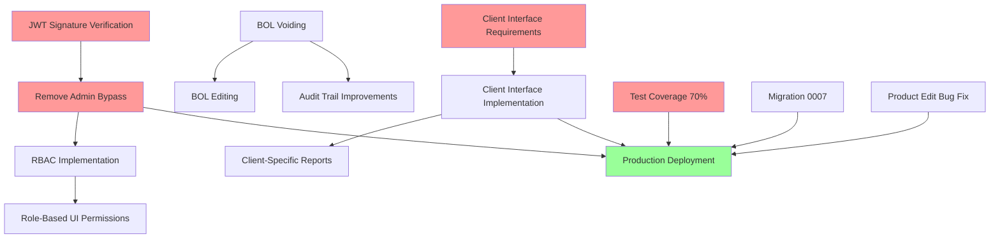

# PrimeTrade Feature Matrix

**Project:** django-primetrade (Bill of Lading Management System)
**Date:** November 2, 2025
**Author:** Claude Code (Production Diagnostic)
**Purpose:** Complete feature inventory for CTO strategic planning

---

## Table of Contents

1. [Feature Status Overview](#feature-status-overview)
2. [Complete Feature Matrix](#complete-feature-matrix)
3. [Feature Categories](#feature-categories)
4. [Implementation Timeline](#implementation-timeline)
5. [Priority Definitions](#priority-definitions)
6. [Testing Coverage by Feature](#testing-coverage-by-feature)

---

## Feature Status Overview

| Status | Count | Percentage | Description |
|--------|-------|------------|-------------|
| ✅ **Implemented** | 23 | 57.5% | Fully functional, in use |
| ⚠️ **Partial** | 8 | 20% | Started but incomplete or has issues |
| ❌ **Missing** | 6 | 15% | Planned but not implemented |
| 🔵 **Needed** | 3 | 7.5% | Discovered during audit, not originally planned |
| **TOTAL** | **40** | **100%** | All features identified |

**Production Readiness:** 57.5% complete (23/40 features)
**Critical Path Blockers:** 4 (Admin Bypass, Client Interface, Test Coverage, JWT Verification)

---

## Complete Feature Matrix

### Core Business Features

| # | Feature | Status | Priority | Complexity | Est. Hours | Tests | Notes |
|---|---------|--------|----------|------------|------------|-------|-------|
| 1 | Product Management (CRUD) | ✅ Implemented | P0 | Low | - | ❌ 0% | Working, needs tests |
| 2 | Customer Management (CRUD) | ✅ Implemented | P0 | Low | - | ❌ 0% | Working, needs tests |
| 3 | Ship-To Management (CRUD) | ✅ Implemented | P0 | Low | - | ❌ 0% | Working, needs tests |
| 4 | Carrier Management (CRUD) | ✅ Implemented | P0 | Low | - | ❌ 0% | Working, needs tests |
| 5 | Lot Management (CRUD) | ✅ Implemented | P1 | Low | - | ❌ 0% | Working, needs tests |
| 6 | BOL Creation (Office Interface) | ✅ Implemented | P0 | High | - | ❌ 0% | Core feature, no tests ⚠️ |
| 7 | BOL Preview Before Confirm | ✅ Implemented | P1 | Medium | - | ❌ 0% | Good UX, needs tests |
| 8 | BOL PDF Generation (ReportLab) | ✅ Implemented | P0 | High | - | ❌ 0% | Critical path, no tests ⚠️ |
| 9 | BOL Auto-Numbering (PRT-YYYY-####) | ✅ Implemented | P0 | Medium | - | ❌ 0% | Working, needs uniqueness test |
| 10 | BOL History View | ✅ Implemented | P1 | Low | - | ❌ 0% | Working, needs tests |
| 11 | Release Upload (PDF Parsing) | ✅ Implemented | P0 | High | - | ❌ 0% | PyPDF2, needs tests |
| 12 | Release Approval/Rejection | ✅ Implemented | P0 | Medium | - | ❌ 0% | Working, needs tests |
| 13 | Release Load Management | ✅ Implemented | P0 | High | - | ❌ 0% | Complex, needs tests ⚠️ |
| 14 | Load-Driven BOL Creation | ✅ Implemented | P0 | High | - | ❌ 0% | Auto-fill from release load |
| 15 | Chemistry Tracking (Lot Validation) | ✅ Implemented | P1 | Medium | - | ❌ 0% | ChemistryValue model, needs tests |
| 16 | Product Balance Calculation | ⚠️ Partial | P1 | Medium | 4-6 | ❌ 0% | Basic, needs shipped tons tracking |
| 17 | Search/Filter BOLs | ⚠️ Partial | P1 | Medium | 6-8 | ❌ 0% | Basic filters, needs advanced search |
| 18 | Bulk Operations (Delete/Export) | ❌ Missing | P2 | Medium | 8-12 | ❌ 0% | Not implemented |
| 19 | BOL Editing (Post-Creation) | ❌ Missing | P2 | High | 12-16 | ❌ 0% | Not implemented, risky (audit trail) |
| 20 | BOL Voiding/Cancellation | ❌ Missing | P1 | Medium | 6-8 | ❌ 0% | Needed for corrections |
| 21 | Report Generation (Analytics) | ❌ Missing | P2 | High | 16-24 | ❌ 0% | Not implemented |
| 22 | Export to Excel/CSV | ❌ Missing | P2 | Low | 4-6 | ❌ 0% | Not implemented |
| 23 | Email BOL to Customer | ❌ Missing | P2 | Medium | 8-12 | ❌ 0% | Not implemented |

**Core Business Subtotal:** 23 features (14 implemented, 2 partial, 7 missing)

---

### Authentication & Security

| # | Feature | Status | Priority | Complexity | Est. Hours | Tests | Notes |
|---|---------|--------|----------|------------|------------|-------|-------|
| 24 | SSO OAuth 2.0 Integration | ✅ Implemented | P0 | High | - | ❌ 0% | Working, needs tests ⚠️ |
| 25 | JWT Role-Based Authorization | ⚠️ Partial | P0 | High | 16-24 | ❌ 0% | BYPASS ACTIVE ⚠️ |
| 26 | Session Management | ✅ Implemented | P0 | Medium | - | ❌ 0% | Django built-in, working |
| 27 | Login/Logout Flow | ✅ Implemented | P0 | Low | - | ❌ 0% | Working, needs tests |
| 28 | Emergency Local Auth | ✅ Implemented | P2 | Low | - | ❌ 0% | Backdoor for SSO failures |
| 29 | JWT Signature Verification | ❌ Missing | P0 | Medium | 6-8 | ❌ 0% | SECURITY ISSUE ⚠️ |
| 30 | Role-Based Access Control (RBAC) | 🔵 Needed | P0 | High | 16-24 | ❌ 0% | Currently all users = admin |
| 31 | Audit Logging (Authentication) | 🔵 Needed | P1 | Low | 2-4 | ❌ 0% | Login/logout not logged |
| 32 | CSRF Protection on API | ⚠️ Partial | P1 | Low | 2-4 | ❌ 0% | Bypassed on API endpoints |

**Security Subtotal:** 9 features (5 implemented, 3 partial, 1 missing, 2 needed)

---

### User Interfaces

| # | Feature | Status | Priority | Complexity | Est. Hours | Tests | Notes |
|---|---------|--------|----------|------------|------------|-------|-------|
| 33 | Admin Dashboard (index.html) | ✅ Implemented | P0 | Low | - | ❌ 0% | Tab-based, working |
| 34 | Office Interface (office.html) | ✅ Implemented | P0 | Medium | - | ❌ 0% | BOL creation form |
| 35 | Client Interface (client.html) | ⚠️ Partial | P0 | Medium | 16-24 | ❌ 0% | UNDEFINED REQUIREMENTS ⚠️ |
| 36 | Product Management UI | ✅ Implemented | P0 | Low | - | ⚠️ Bug | Product edit returns 400 error |
| 37 | Customer Management UI | ✅ Implemented | P0 | Low | - | ❌ 0% | Working |
| 38 | Carrier Management UI | ✅ Implemented | P0 | Low | - | ❌ 0% | Working |
| 39 | Release Upload UI | ✅ Implemented | P0 | Medium | - | ❌ 0% | PDF upload + approval |
| 40 | Branding Customization | ⚠️ Partial | P2 | Low | 4-6 | ⚠️ Bug | /api/branding endpoint removed |

**UI Subtotal:** 8 features (6 implemented, 2 partial)

---

## Feature Categories

### By Implementation Status

#### ✅ Implemented (23 Features)

**Master Data Management:**
1. Product Management (CRUD)
2. Customer Management (CRUD)
3. Ship-To Management (CRUD)
4. Carrier Management (CRUD)
5. Lot Management (CRUD)

**BOL Operations:**
6. BOL Creation (Office Interface)
7. BOL Preview Before Confirm
8. BOL PDF Generation
9. BOL Auto-Numbering
10. BOL History View
11. Load-Driven BOL Creation

**Release Management:**
12. Release Upload (PDF Parsing)
13. Release Approval/Rejection
14. Release Load Management

**Chemistry Tracking:**
15. Chemistry Tracking (Lot Validation)

**Authentication:**
16. SSO OAuth 2.0 Integration
17. Session Management
18. Login/Logout Flow
19. Emergency Local Auth

**User Interfaces:**
20. Admin Dashboard
21. Office Interface
22. Product Management UI
23. Customer Management UI
24. Carrier Management UI
25. Release Upload UI

---

#### ⚠️ Partial (8 Features)

| Feature | Issue | Impact | Fix Effort |
|---------|-------|--------|------------|
| **JWT Role-Based Authorization** | Admin bypass active via `ADMIN_BYPASS_EMAILS` | 🔴 CRITICAL - Anyone in list = admin | 16-24 hours |
| **Client Interface** | Undefined requirements, basic view only | 🔴 BLOCKING - Need CTO clarification | 16-24 hours |
| **Product Balance Calculation** | Doesn't track shipped tons accurately | 🟡 MEDIUM - Manual verification needed | 4-6 hours |
| **Search/Filter BOLs** | Basic date filter only, no advanced search | 🟡 MEDIUM - UX limited | 6-8 hours |
| **CSRF Protection on API** | Bypassed via `CsrfExemptSessionAuthentication` | 🟡 MEDIUM - Session auth mitigates | 2-4 hours |
| **Product Management UI** | Edit returns 400 "already exists" error | 🟡 MEDIUM - Can't update start_tons | 2-4 hours |
| **Branding Customization** | `/api/branding` endpoint removed, 404 errors | 🟢 LOW - Cosmetic issue | 4-6 hours |

---

#### ❌ Missing (6 Features)

| Feature | Business Impact | Priority | Workaround Available? |
|---------|----------------|----------|----------------------|
| **JWT Signature Verification** | 🔴 CRITICAL - Trusts unverified tokens | P0 | No - Security issue |
| **BOL Voiding/Cancellation** | 🟡 MEDIUM - Manual database edits for corrections | P1 | Yes - Admin can edit DB |
| **Bulk Operations** | 🟢 LOW - Convenience feature | P2 | Yes - Manual one-by-one |
| **BOL Editing** | 🟡 MEDIUM - Can't fix typos after creation | P2 | Yes - Void + recreate |
| **Report Generation** | 🟢 LOW - Manual Excel analysis | P2 | Yes - Export to CSV (when implemented) |
| **Export to Excel/CSV** | 🟢 LOW - Manual copy-paste | P2 | Yes - Screenshot or manual entry |
| **Email BOL to Customer** | 🟢 LOW - Manual email with PDF attachment | P2 | Yes - Download PDF, email manually |

---

#### 🔵 Needed (3 Features - Discovered During Audit)

| Feature | Why Needed | Priority | Impact if Not Implemented |
|---------|------------|----------|--------------------------|
| **Role-Based Access Control (RBAC)** | Currently all authenticated users = admin | P0 | Security issue - No least privilege |
| **Audit Logging (Authentication)** | Login/logout events not logged | P1 | Compliance issue - No access trail |

---

## Implementation Timeline

### Phase 1: Production Blockers (MUST COMPLETE)

**Timeline:** 2-3 weeks (80-120 hours)
**Priority:** P0 - BLOCKING PRODUCTION

| Feature | Effort | Depends On | Assignee | Status |
|---------|--------|------------|----------|--------|
| JWT Signature Verification | 6-8 hours | None | TBD | ❌ Not started |
| Remove/Formalize Admin Bypass | 16-24 hours | JWT verification | TBD | ❌ Not started |
| Define Client Interface Requirements | 0 hours | CTO decision | Clif | ⚠️ Needs decision |
| Implement Client Interface | 16-24 hours | Requirements defined | TBD | ❌ Not started |
| Increase Test Coverage to 70% | 40-60 hours | None (parallel) | TBD | ❌ Not started |
| Fix Product Edit Bug | 2-4 hours | None | TBD | ❌ Not started |
| Apply Migration 0007 | 0.5 hours | None | TBD | ❌ Not started |

**TOTAL EFFORT:** 80-120 hours (~2-3 weeks for 1 developer)

---

### Phase 2: Production Nice-to-Haves (RECOMMENDED)

**Timeline:** 1-2 weeks (40-80 hours)
**Priority:** P1 - RECOMMENDED BEFORE LAUNCH

| Feature | Effort | Depends On | Assignee | Status |
|---------|--------|------------|----------|--------|
| BOL Voiding/Cancellation | 6-8 hours | None | TBD | ❌ Not started |
| RBAC Implementation | 16-24 hours | Admin bypass removed | TBD | ❌ Not started |
| Audit Logging (Auth Events) | 2-4 hours | None | TBD | ❌ Not started |
| Product Balance Calculation (Fix) | 4-6 hours | None | TBD | ❌ Not started |
| Advanced BOL Search/Filter | 6-8 hours | None | TBD | ❌ Not started |
| CSRF Protection on API (Fix) | 2-4 hours | None | TBD | ❌ Not started |

**TOTAL EFFORT:** 36-54 hours (~1 week for 1 developer)

---

### Phase 3: Post-Launch Enhancements (OPTIONAL)

**Timeline:** 3-4 weeks (120-160 hours)
**Priority:** P2 - POST-LAUNCH

| Feature | Effort | Depends On | Assignee | Status |
|---------|--------|------------|----------|--------|
| Bulk Operations | 8-12 hours | None | TBD | ❌ Not started |
| BOL Editing (Post-Creation) | 12-16 hours | RBAC, Audit logging | TBD | ❌ Not started |
| Report Generation (Analytics) | 16-24 hours | None | TBD | ❌ Not started |
| Export to Excel/CSV | 4-6 hours | None | TBD | ❌ Not started |
| Email BOL to Customer | 8-12 hours | None | TBD | ❌ Not started |
| Branding Customization (Fix) | 4-6 hours | None | TBD | ❌ Not started |

**TOTAL EFFORT:** 52-76 hours (~1.5-2 weeks for 1 developer)

---

## Priority Definitions

### P0 - Critical (Production Blocking)

**Must be completed before production launch. No workarounds.**

- JWT Signature Verification
- Admin Bypass Resolution
- Client Interface Definition + Implementation
- Test Coverage (70% target)
- Product Edit Bug Fix
- Migration 0007 Application

**Rationale:** Security, compliance, or core functionality that cannot be worked around.

---

### P1 - Important (Recommended Before Launch)

**Should be completed before production. Workarounds exist but painful.**

- BOL Voiding/Cancellation
- RBAC Implementation
- Audit Logging (Auth Events)
- Product Balance Calculation Fix
- Advanced BOL Search/Filter
- CSRF Protection Fix

**Rationale:** Impacts operations or UX, but manual workarounds available.

---

### P2 - Nice-to-Have (Post-Launch)

**Can be added after production launch. Low business impact.**

- Bulk Operations
- BOL Editing
- Report Generation
- Export to Excel/CSV
- Email BOL to Customer
- Branding Customization

**Rationale:** Convenience features that don't block daily operations.

---

## Testing Coverage by Feature

### Current Overall Coverage: 16%

**Coverage Breakdown:**
- **bol_system/__init__.py:** 100% (empty file)
- **bol_system/admin.py:** 54% (admin registration)
- **bol_system/models.py:** 69% (models imported in tests, but logic not tested)
- **bol_system/serializers.py:** 0% ⚠️
- **bol_system/views.py:** 0% ⚠️ CRITICAL PATH UNTESTED
- **primetrade_project/auth_views.py:** Not measured (should be ~0%)

### Features with 0% Test Coverage (HIGH RISK)

| Feature | Complexity | Risk if Fails | Test Priority |
|---------|------------|---------------|---------------|
| **BOL Creation** | High | 🔴 CRITICAL - Core business function | P0 |
| **BOL PDF Generation** | High | 🔴 CRITICAL - Unusable without PDF | P0 |
| **Release Approval** | Medium | 🔴 CRITICAL - Blocks BOL creation | P0 |
| **Release Load Management** | High | 🔴 CRITICAL - Data integrity | P0 |
| **SSO Authentication** | High | 🔴 CRITICAL - No access to app | P0 |
| **Product Balance Calculation** | Medium | 🟡 MEDIUM - Wrong numbers shown | P1 |
| **Chemistry Tracking** | Medium | 🟡 MEDIUM - Lot validation fails | P1 |
| **BOL Auto-Numbering** | Medium | 🔴 CRITICAL - Duplicate BOL numbers | P0 |

### Recommended Test Coverage Targets

**Phase 1 (Production Launch):**
- Overall coverage: ≥70% (MEDIUM RISK protocol requirement)
- views.py: ≥80% (critical business logic)
- auth_views.py: ≥70% (security critical)
- models.py: ≥90% (data integrity)
- serializers.py: ≥80% (validation logic)

**Phase 2 (Post-Launch):**
- Overall coverage: ≥85%
- All critical paths: 100%
- Edge cases: 100%
- Error handling: 100%

---

## Feature Dependencies

**Critical Path:** JWT Verification → Admin Bypass Removal → RBAC → Production
**Parallel Path:** Client Interface Requirements → Implementation → Production
**Blocking:** Test Coverage 70% (can run in parallel)

---

## Assumptions & Constraints

### Assumptions

1. **Team Size:** 1 developer (estimates based on solo work)
2. **Working Hours:** 40 hours/week (no crunch time assumed)
3. **Skill Level:** Mid-level Django developer (knows framework, needs guidance on security)
4. **Testing:** Developer writes tests alongside code (not separate QA phase)
5. **Deployment:** Automated via Render (no manual deployment time)

### Constraints

1. **Budget:** Free tier (Neon, Render) - No paid services without approval
2. **Timeline:** Production needed ASAP (but "right" beats "fast")
3. **Dependencies:** SSO server (barge2rail-auth) not under PrimeTrade control
4. **Scale:** 6-8 users max (no over-engineering for scale)
5. **Compliance:** Must maintain audit trail (AuditLog model)

---

## Questions for CTO Decision

These features have ambiguous requirements that block implementation:

### 1. Client Interface Scope (BLOCKING)

**Question:** What should the "Client Interface" (client.html) provide?

**Options:**
- **A) Read-Only BOL History** - View past BOLs, no creation (4-6 hours)
- **B) Self-Service BOL Creation** - Clients create their own BOLs (16-24 hours)
- **C) Approval Workflow** - Clients request BOLs, office approves (24-32 hours)
- **D) External Portal** - Separate authenticated portal for customers (40-60 hours)

**Impact:** BLOCKS production launch (undefined feature)
**Recommendation:** Start with Option A (read-only), add features post-launch

---

### 2. Admin Bypass Resolution (BLOCKING)

**Question:** How should we resolve the `ADMIN_BYPASS_EMAILS` security issue?

**Options:**
- **A) Fix SSO Server** - Update barge2rail-auth to include `application_roles['primetrade']` in JWT (0 hours for PrimeTrade, depends on SSO team)
- **B) Database Roles** - Store roles in PrimeTrade database, manual admin UI to grant roles (16-24 hours)
- **C) Temporary Admin UI** - Build admin interface to assign roles until SSO fixed (12-16 hours)

**Impact:** BLOCKS production launch (security issue)
**Recommendation:** Option A (fix SSO) if possible, otherwise Option B (database roles)

---

### 3. BOL Editing Policy (POST-LAUNCH)

**Question:** Should users be able to edit BOLs after creation? If yes, which fields?

**Options:**
- **A) No Editing** - BOLs are immutable, use voiding + recreate for corrections (0 hours)
- **B) Limited Editing** - Only non-critical fields (buyer name, PO number) within 24 hours (8-12 hours)
- **C) Full Editing** - All fields, with audit trail and version history (16-24 hours)

**Impact:** Affects operations workflow (how to handle mistakes)
**Recommendation:** Option A (no editing) for simplicity, void + recreate is cleaner audit trail

---

## Document Metadata

**Generated:** November 2, 2025
**Generator:** Claude Code (Production Diagnostic)
**Project:** django-primetrade v1.0
**Location:** /Users/cerion/Projects/django-primetrade
**Total Features:** 40 (23 implemented, 8 partial, 6 missing, 3 needed)
**Production Readiness:** 57.5% complete
**Estimated Work Remaining:** 168-250 hours (4-6 weeks for 1 developer)
**Next Steps:** Review PRODUCTION_GAPS.md, CTO_HANDOFF.md
